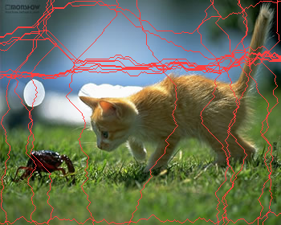

# Seam Carving

## 概要

这个项目主要就是实现论文*Seam Carving for Content-Aware Image Resizing* (SIGGRAPH 2007)中描述的算法，用于对图像进行缩放而不破坏内容。

我实现了：

* 基础算法：seam计算、单向图像缩小
* 图像放大
* 双向缩小放大
* 对象移除

此外，对于一个特别的例子，我对比了使用Sobel和Laplacian两种算子（计算seam需要用到图像能量，可以用梯度算子计算）的效果。

## 实现细节

### seam计算

seam计算实际上就是用动态规划找一条水平或竖直的、能量最小的线。能量的计算我使用OpenCV提供的算子。

主要实现在`seam_carving.hpp`：

```c++
// 求解水平的seam
template <typename COMPARE_FUNC = std::less<int> >
path_result find_hori_seam(const cv::Mat &energy_image,
                           weighted_int_t *buffer = nullptr,
                           COMPARE_FUNC cmp = std::less<int>())
{
    weighted_int_t *dp;
    if (!buffer)
    {
        dp = new weighted_int_t[(energy_image.cols + 1) * energy_image.rows];
    }
    else
    {
        dp = buffer;
    }

    // 初始层（列）
    for (int y = 1; y < energy_image.rows - 1; ++y)
    {
        energy_t e = energy_image.at<energy_t>(y, 0);
        dp[y] = weighted_int_t { e, -1 };
    }

    // dp
    weighted_int_t *last_level = dp, *current_level = dp + energy_image.rows;
    for (int x = 1; x < energy_image.cols; ++x)
    {
        for (int y = 1; y < energy_image.rows - 1; ++y)
        {
            weighted_int_t &e_min = current_level[y];

            // weight存放当前（一小段）seam的总能量
            // value存放当前seam当前点左边一个点（x-1）的y坐标，用于回溯
            // 如果从(x - 1, y)过来
            e_min.weight = last_level[y].weight; // 之后统一加上当前点的能量
            e_min.value = y;

            // 如果从(x - 1, y - 1)过来
            if (y - 1 >= 1 && cmp(last_level[y - 1].weight, e_min.weight))
            {
                e_min.weight = last_level[y - 1].weight;
                e_min.value = y - 1;
            }

            // 如果从(x - 1, y + 1)过来
            if (y + 1 < energy_image.rows - 1 && cmp(last_level[y + 1].weight, e_min.weight))
            {
                e_min.weight = last_level[y + 1].weight;
                e_min.value = y + 1;
            }

            energy_t e = energy_image.at<energy_t>(y, x);
            e_min.weight += e;
        }

        last_level += energy_image.rows;
        current_level += energy_image.rows;
    }

    // 准备好最后一层的信息，方便后续操作
    for (int y = 1; y < energy_image.rows - 1; ++y)
    {
        weighted_int_t &e_min = current_level[y];

        // (x - 1, y)
        e_min.weight = last_level[y].weight;
        e_min.value = y;
    }

    // 最后一层，直接找一个能量最小的
    weighted_int_t *e_min;
    e_min = std::min_element(current_level + 1, current_level + (energy_image.rows - 1));

    //  一层一层回溯，得到seam
    std::vector<int> energy_min_path(energy_image.cols);
    energy_min_path[energy_image.cols - 1] = e_min->value;
    for (int x = energy_image.cols - 2; x >= 0; --x)
    {
        energy_min_path[x] = last_level[energy_min_path[x + 1]].value;
        last_level -= energy_image.rows;
    }

    if (!buffer)
    {
        delete [] dp;
    }

    return path_result { std::move(energy_min_path), e_min->weight };
}

template <typename COMPARE_FUNC = std::less<int> >
path_result find_vert_seam(const cv::Mat &energy_image,
                           weighted_int_t *buffer = nullptr,
                           COMPARE_FUNC cmp = std::less<int>())
{
  /* 实现类似 */
}
```

### 图像缩小

seam计算出来之后，只需要将此seam从原图中去除（后续像素向前平移），即可获得长度或者宽度缩小一个像素之后的新图。如此不断重复，即可单向缩小任意像素。

由于我实现了双向缩放，所以这个功能就不单独展示代码了。

### 图像放大

图像放大的本质就是逆向缩小。考虑一条能量最小的seam，将其复制一份（后续像素向后平移）就可以获得长度或者宽度放大一个像素之后的新图。但是这有个问题，每次复制的都是同一条线。解决办法比较直接，每次复制完seam之后，在能量图中将原seam和复制出来的seam的能量都置为无穷大，这样这条seam之后就不会被选中了。同时，如果放大后的大小是原图的两倍以上，则效果和直接拉伸没有显著区别。为了解决这个问题，可以采用分段放大的办法，例如将512x512的图片放大为1024x512，则可以先使用该算法放大为768x512，然后再次放大为1024x512。双向放大的原理是一致的。

由于我实现了双向缩放，所以这个功能就不单独展示代码了。

### 双向缩小放大

关于双向缩小放大，一个直接的想法是先后进行长和宽的单向缩放。但是，这样忽略了图像水平和竖直方向之间的耦合，效果可能不佳。论文中描述的方法是对水平和竖直方向同时进行动态规划，来选取最优的seam来去除或添加，这样有很严重的性能问题：时间复杂度和空间复杂度都太高，为O($n^2m^2$)，n、m为图片的长、宽。甚至，对于较大的图像，内存根本不足以存放算法所需数据。基于这些考虑，我的实现类似于对这两个想法进行折中，我使用了贪心的思想，每次选取水平和竖直方向分别最优的seam中，能量值更小的那个。一点细节问题，就是当水平或者竖直方向中某一个方向的缩放已经完成，这个时候只有竖直或者水平方向的seam可选，那么就选唯一可选的那个。总之，这应该算是一个不错的近似解。值得注意的是，我在比较水平和竖直方向seam能量值的时候，没有对能量值进行额外的类似于归一化的操作。

双向放大的具体实现：

```c++
void image_extend(cv::Mat &image, int dc, int dr, energy_func_t energy_func)
{
    int r = 0, c = 0;

    cv::Mat gray_image;
    cv::cvtColor(image, gray_image, cv::COLOR_BGR2GRAY);
    cv::Mat energy_image = energy_func(gray_image);

    weighted_int_t *dp_buffer = new weighted_int_t[(image.cols + dc + 1) * (image.rows + dr + 1)];
    while (r + c < dr + dc)
    {
        if (r == dr) // 水平方向已经结束了，只处理竖直方向
        {
            path_result p = find_vert_seam(energy_image, dp_buffer); // 寻找seam
            // 修改能量为“无穷大”，防止再次被选中
            set_path_vert<1, energy_t>(energy_image, p.path, std::vector<energy_t> { energy_inf });
            // 复制这个seam
            image = insert_path_vert<3, unsigned char>(image, p.path);
            // 注意：在能量图中也要复制这个seam
            energy_image = insert_path_vert<1, energy_t>(energy_image, p.path);
            // 修改能量为“无穷大”，防止再次被选中
            set_path_vert<1, energy_t>(energy_image, p.path, std::vector<energy_t> { energy_inf });
            ++c;
            fprintf(stderr, "|");
        }
        else if (c == dc) // 竖直方向已经结束了，只处理水平方向
        {
            path_result p = find_hori_seam(energy_image, dp_buffer);
            set_path_hori<1, energy_t>(energy_image, p.path, std::vector<energy_t> { energy_inf });
            image = insert_path_hori<3, unsigned char>(image, p.path);
            energy_image = insert_path_hori<1, energy_t>(energy_image, p.path);
            // 修改能量为“无穷大”，防止再次被选中
            set_path_hori<1, energy_t>(energy_image, p.path, std::vector<energy_t> { energy_inf });
            ++r;
            fprintf(stderr, "-");
        }
        else // r != dr && c != dc
        {
            // 求解水平和竖直方向分别最优的seam
            path_result pv = find_vert_seam(energy_image, dp_buffer),
                        ph = find_hori_seam(energy_image, dp_buffer);
            // 贪心：选取水平和竖直方向分别最优的seam，能量值更小的那个
            if (pv.total_energy < ph.total_energy)
            {
                set_path_vert<1, energy_t>(energy_image, pv.path, std::vector<energy_t> { energy_inf });
                image = insert_path_vert<3, unsigned char>(image, pv.path);
                energy_image = insert_path_vert<1, energy_t>(energy_image, pv.path);
                // 修改能量为“无穷大”，防止再次被选中
                set_path_vert<1, energy_t>(energy_image, pv.path, std::vector<energy_t> { energy_inf });
                ++c;
                fprintf(stderr, "|");
            }
            else
            {
                set_path_hori<1, energy_t>(energy_image, ph.path, std::vector<energy_t> { energy_inf });
                image = insert_path_hori<3, unsigned char>(image, ph.path);
                energy_image = insert_path_hori<1, energy_t>(energy_image, ph.path);
                // 修改能量为“无穷大”，防止再次被选中
                set_path_hori<1, energy_t>(energy_image, ph.path, std::vector<energy_t> { energy_inf });
                ++r;
                fprintf(stderr, "-");
            }
        }
    }
    delete [] dp_buffer;
}
```

双向缩小与放大是类似的，不过更简单（不需要标记某些seam的能量为无穷大，只需要去除即可）。

### 对象移除

对象移除功能实现上也比较简单，只需要在能量图中，将需要移除的对象的能量值设定为无穷小。这样，在缩小的时候，算法一定会选择包含有这个对象的seam并去除，这就达到了目的。关于选择水平还是竖直的seam，类似于双向缩放，我也使用了贪心的办法。标记需要移除的对象可以用mask图或者GUI来实现，为方便起见，我实现了mask。此外，算法终止于该物体的所有像素都被去除。并且，为了灵活性，我在移除物体之后没有强制将图恢复原来的大小，使用者可以根据需要再放大。

```c++
void object_remove(cv::Mat &image, cv::Mat mask, energy_func_t energy_func)
{
    cv::Mat gray_image;
    cv::cvtColor(image, gray_image, cv::COLOR_BGR2GRAY);

    int r = 0, c = 0;

    weighted_int_t *dp_buffer = new weighted_int_t[(image.cols + 1) * (image.rows + 1)];
    while (true)
    {
        cv::Mat energy_image = energy_func(gray_image);
        apply_mask(energy_image, mask); // 对象移除的关键：把需要移除的对象的能量值设置为负无穷

        // 下面和双向缩放是类似的
        path_result pv = find_vert_seam(energy_image, dp_buffer),
                    ph = find_hori_seam(energy_image, dp_buffer);

        // 所有需要删去的seam都已删去
        if (pv.total_energy > 0 && ph.total_energy > 0)
        {
            break;
        }

        // 贪心
        if (pv.total_energy < ph.total_energy)
        {
            image = remove_path_vert<3, unsigned char>(image, pv.path);
            mask = remove_path_vert<1, unsigned char>(mask, pv.path);
            gray_image = remove_path_vert<1, unsigned char>(gray_image, pv.path);
            ++c;
            fprintf(stderr, "|");
        }
        else
        {
            image = remove_path_hori<3, unsigned char>(image, ph.path);
            mask = remove_path_hori<1, unsigned char>(mask, ph.path);
            gray_image = remove_path_hori<1, unsigned char>(gray_image, ph.path);
            ++r;
            fprintf(stderr, "-");
        }
    }
    delete [] dp_buffer;
}
```

## 几个例子

### 1

我对这个图进行了宽度的缩小以及高度的放大和对象移除。

**原图**


**seam图**


**缩放后图**


**mask图**


**对象移除后**


### 2

这个图比较有特点，我对这个图使用Sobel和Laplacian两种算子分别进行了双向缩小测试。注意：缩小程度小于棋盘格线的大小。

**原图**


**能量图（Sobel算子）**


**seam图（Sobel算子）**


**缩放后图（Sobel算子）**


**能量图（Laplacian算子）**


**seam图（Laplacian算子）**


**缩放后图（Laplacian算子）**


**几点讨论**

使用Sobel算子缩小所得图片中，棋盘刻线仍然保持直线，但是格子大小分布诡异，都变成了长方形。而使用Laplacian算子缩小所得图片中，棋盘刻线变弯，但是格子大小分布仍然比较均匀，能够尽量保持在正方形。此外，使用Sobel算子缩小后，格点保持的较好，而使用Laplacian算子缩小后，格点湮灭了。

我注意到Sobel算子生成的能量图片比较光滑（注意棋盘的背景），而Laplacian算子生成的能量图片不那么光滑。在测试中，我发现这一点对其他图片也适用。

### 3

我对这个图进行了双向缩小。

**原图**


**seam图**


**缩放后图**


### 4

我对这个图进行了双向缩小。

**原图**


**seam图**


**缩放后图**


### 5

我对这个图进行了双向缩小和对象移除。

**原图**


**seam图**


**缩放后图**


**mask图**


**对象移除后**


### 6

我对这个图进行了双向缩小和对象移除。

**原图**


**seam图**


**缩放后图**


**mask图**


**对象移除后**


### 自选1

我对这个图进行了高度的缩小和对象移除。

**原图**


**seam图**



**缩放后图**


**mask图**


**对象移除后**


### 自选2

我对这个图进行了双向缩小。

**原图**


**seam图**


**缩放后图**


### 自选3

我对这个图进行了双向放大。

**原图**


**seam图**


**缩放后图**


### 自选4

我对这个图进行了高度的缩小。

**原图**


**seam图**


**缩放后图**


### 自选5

我对这个图进行了双向缩小，缩小后黑球球变成方形的了，同样可爱。

**原图**


**seam图**


**缩放后图**

